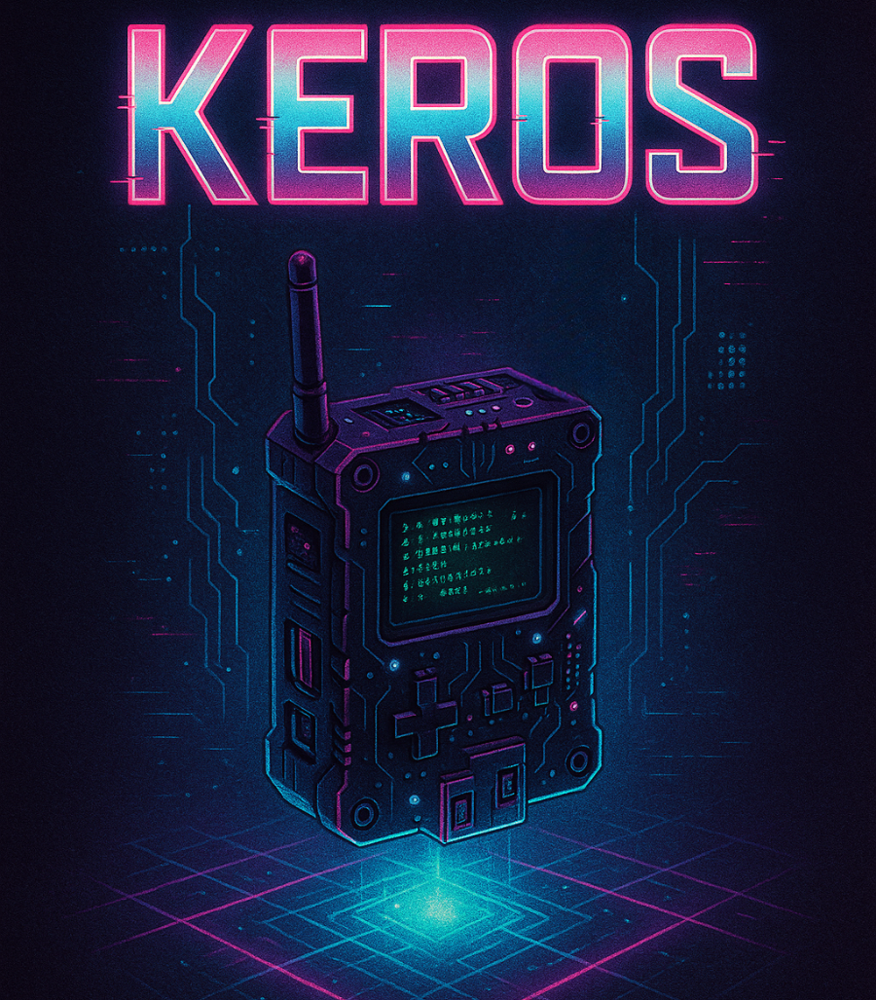
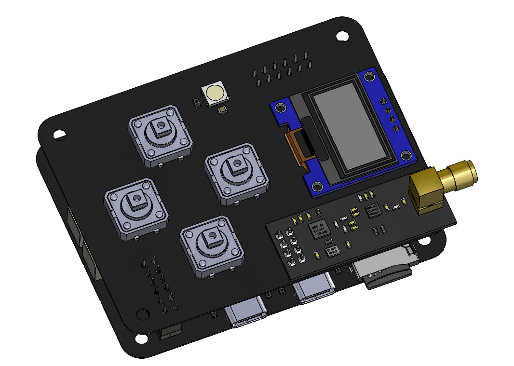
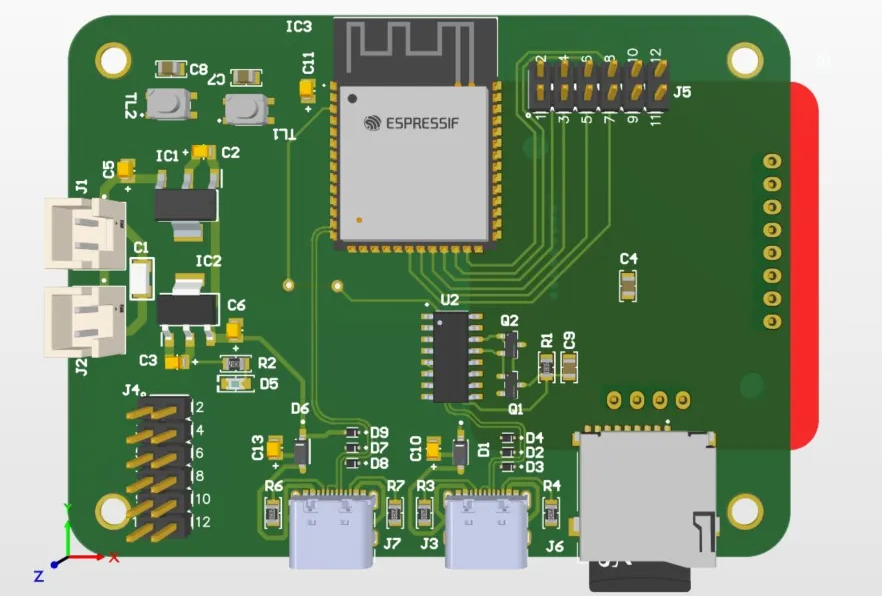
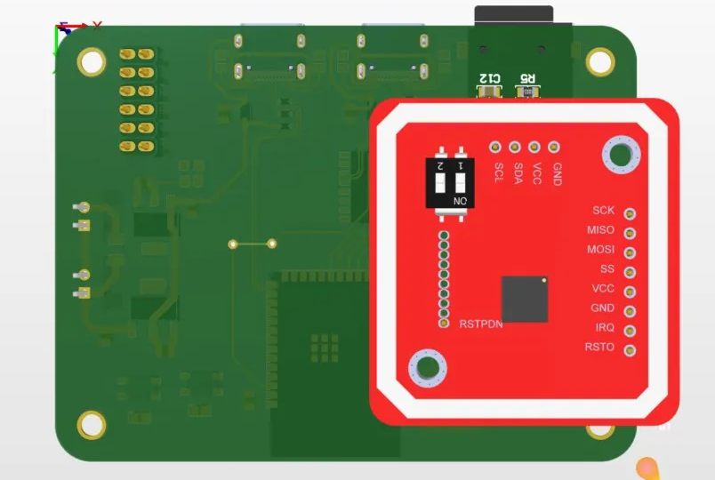
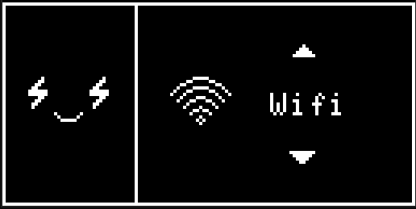
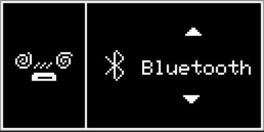
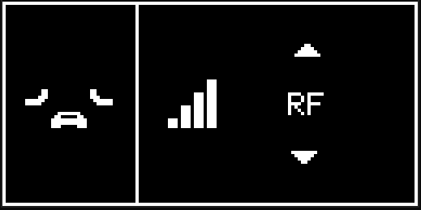
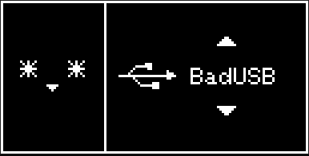

```
 ██╗  ██╗███████╗██████╗  ██████╗ ███████╗
 ██║ ██╔╝██╔════╝██╔══██╗██╔═══██╗██╔════╝
 █████╔╝ █████╗  ██████╔╝██║   ██║███████╗
 ██╔═██╗ ██╔══╝  ██╔══██╗██║   ██║╚════██║
 ██║  ██╗███████╗██║  ██║╚██████╔╝███████║
 ╚═╝  ╚═╝╚══════╝╚═╝  ╚═╝ ╚═════╝ ╚══════╝
```

### **Portable Wireless Hacking & Security Research Device**

> *Open-source multi-protocol pentesting tool for WiFi, Bluetooth, NFC/RFID, and RF auditing*

<p align="center">
  
</p>

```
[SYSTEM ONLINE] > Initializing wireless protocols...
[SYSTEM ONLINE] > ESP32-S3 core loaded
[SYSTEM ONLINE] > RF modules detected
[SYSTEM ONLINE] > Ready for security research
```

---

# VISION

**KEROS** is a pocket-sized, open-source hardware platform designed for ethical hacking, wireless security auditing, and cybersecurity research. Inspired by tools like Flipper Zero but built with accessibility, modularity, and community collaboration at its core.

KEROS empowers security researchers, pentesters, students, and makers to explore wireless protocols, understand vulnerabilities, and develop defensive strategies—all from a single portable device.

### Why KEROS?

- **Affordable**: Optimized component selection keeps costs low without sacrificing capability
- **Open-source**: Firmware, schematics, and documentation publicly available
- **Modular**: Expandable architecture for future protocols and integrations
- **Community-driven**: Built by hackers, for hackers
- **Autonomous**: No PC required—operates standalone with intuitive interface

---

# ETHICAL DISCLAIMER

```
┌─────────────────────────────────────────────────┐
│  [!] FOR AUTHORIZED TESTING ONLY                │
│                                                 │
│  KEROS is designed exclusively for:             │
│  → Educational purposes                         │
│  → Authorized penetration testing               │
│  → Controlled laboratory environments           │
│  → Personal network security research           │
│                                                 │
│  Unauthorized access to networks, devices, or   │
│  systems is illegal. Users are solely           │
│  responsible for compliance with local laws.    │
│                                                 │
│  The developers and contributors assume NO      │
│  responsibility for misuse of this tool.        │
└─────────────────────────────────────────────────┘
```

---

# HARDWARE ARCHITECTURE

<p align="center">
  
</p>

KEROS features a dual-board design optimized for portability and functionality:

## Upper Board (Interface + RF)

**Components**: NRF24L01+PA+LNA (2.4GHz RF) • OLED 0.96" (128x64) • Capacitive touch buttons (4x) • RGB addressable LED • 12-pin M20 connector

<p align="center">
  
</p>

## Lower Board (Core + Modules)

**Components**: ESP32-S3-WROOM-1-N8R8 • PN532 NFC/RFID • CH340G USB-Serial • TP4056 + LiPo 2500mAh • AMS1117 regulators • MicroSD slot (TF-01A)

<p align="center">
  
</p>

### System Specifications

**Power**: 3.7V 2500mAh LiPo battery with USB-C charging  
**Dimensions**: Pocket-sized form factor  
**Connectivity**: USB, GPIO expansion, modular connectors

---

# CORE CAPABILITIES

## `[WiFi]` Wireless Network Auditing

```
> Scan networks (SSID, channel, RSSI, encryption)
> Capture WPA/WPA2 handshakes
> Deauthentication attacks (802.11 management frames)
> Evil Twin AP creation (fake access points)
> Beacon spam / channel flooding [IN DEVELOPMENT]
> WPA3 support [IN DEVELOPMENT]
> Wardriving with GPS [PLANNED]
```

<p align="center">
  
</p>

**Implemented**: Network scanning, handshake capture, deauth, Evil Twin  
**Use case**: Test network resilience, identify weak configurations, capture auth packets for offline analysis

---

## `[Bluetooth]` BT/BLE Security Testing

```
> Classic and BLE device discovery [IN DEVELOPMENT]
> BLE traffic sniffing (advertising packets) [IN DEVELOPMENT]
> Bluetooth jamming (2.4GHz interference)
> BLE flooding attacks [IN DEVELOPMENT]
> MITM (Man-in-the-Middle) [IN DEVELOPMENT]
```

<p align="center">
  
</p>

**Implemented**: Bluetooth jamming  
**Use case**: Test IoT device resilience, analyze BLE beacons, probe wireless peripherals

---

## `[NFC/RFID]` Contactless Systems

```
> Read ISO14443A cards (Mifare Classic/Ultralight) [IN DEVELOPMENT]
> Tag emulation [IN DEVELOPMENT]
> Mifare cloning [IN DEVELOPMENT]
> NFC relay attacks [IN DEVELOPMENT]
> 125kHz RFID support [PLANNED]
```

<p align="center">
  
</p>

**Hardware**: PN532 module (13.56MHz)  
**Use case**: Audit access control systems, analyze contactless payment cards, test proximity-based security

---

## `[RF 2.4GHz]` Proprietary Protocol Analysis

```
> Sniff wireless peripherals (keyboards, mice, remotes)
> Capture IoT sensor telemetry
> Selective channel jamming [IN DEVELOPMENT]
> Protocol reverse engineering [IN DEVELOPMENT]
```

<p align="center">
  
</p>

**Hardware**: NRF24L01+PA+LNA transceiver  
**Use case**: Analyze non-standard RF protocols, test wireless device security

---

## `[BadUSB]` HID Attack Emulation

```
> Rubber Ducky-style keystroke injection [PLANNED]
> DuckyScript payload support [PLANNED]
> Automated social engineering testing [PLANNED]
```

<p align="center">
  
</p>

**Use case**: Test endpoint security, simulate physical access attacks in controlled environments

---

## `[Interface]` User Experience

```
> OLED navigable menus (0.96" 128x64)
> Capacitive touch button controls
> RGB status LED (green=success, red=error, blue=scanning)
> MicroSD data logging [IN PROGRESS]
> OTA firmware updates [PLANNED]
> Larger 1.3" OLED upgrade [PLANNED]
```

---

# FIRMWARE STATUS

## ✅ Implemented

| Module | Feature | Status |
|--------|---------|--------|
| WiFi | Network scanning, handshake capture, deauth, Evil Twin | **OPERATIONAL** |
| Bluetooth | Jamming | **OPERATIONAL** |
| RF 2.4GHz | Sniffing, selective jamming | **OPERATIONAL** |
| Interface | OLED menus, LED indicators, button navigation | **OPERATIONAL** |
| Storage | MicroSD logging | **OPERATIONAL** |

## In Active Development

| Module | Feature | Target |
|--------|---------|--------|
| WiFi | Evil Twin advanced (captive portals), WPA3 support, beacon spam | Q1 2026 |
| Bluetooth | BT/BLE scanning, BLE sniffing, flooding attacks, MITM | Q1 2026 |
| NFC/RFID | ISO14443A reading, tag emulation, Mifare cloning, relay attacks | Q2 2026 |
| RF 2.4GHz | Proprietary protocol attacks, replay | Q2 2026 |

## Planned Features

| Module | Feature | Timeline |
|--------|---------|----------|
| RF Sub-GHz | CC1101 integration (433/868MHz), replay attacks | Q3 2026 |
| RF Expansion | LoRa, Zigbee, Thread (Matter) modules | 2026-2027 |
| BadUSB | HID emulation, DuckyScript scripting | Q2 2026 |
| System | OTA updates, plugin architecture (Lua/Python) | Q3 2026 |
| Interface | Pentest profiles, graphical UI, 1.3" OLED | Q4 2026 |

---

# ROADMAP

### Phase 1: Core Functionality (Current)
- Stabilize WiFi, Bluetooth, RF 2.4GHz modules
- Complete NFC/RFID implementation
- MicroSD logging finalization

### Phase 2: Protocol Expansion (2026)
- WPA3 support
- BLE MITM and advanced attacks
- Sub-GHz RF (CC1101) integration
- BadUSB development

### Phase 3: Modular Ecosystem (2026-2027)
- Plugin system for community scripts
- Hardware expansion modules (LoRa, Zigbee, Thread)
- OTA firmware updates
- Graphical interface improvements
- Pentest scenario profiles

### Phase 4: Community Growth (Ongoing)
- Open-source hardware revisions
- Educational documentation and tutorials
- Integration with existing tools (Pwnagotchi, NRFBox, Bruce, etc.)
- Collaborative feature development

---

# OPEN SOURCE PHILOSOPHY

KEROS is built on the principles of transparency, collaboration, and accessibility.

### Why Open Source?

- **Education**: Learn hardware hacking by studying real schematics and code
- **Security**: Auditable firmware ensures no backdoors or malicious code
- **Innovation**: Community contributions drive feature development
- **Affordability**: No proprietary markups—just component costs
- **Longevity**: Project survives beyond original creators

### What's Open?

```
├── Firmware (ESP32-S3 code)
├── Hardware schematics (KiCad files)
├── PCB designs and layouts
├── 3D-printable enclosure designs
├── Technical documentation
└── Example scripts and payloads
```

All repositories are licensed under permissive open-source licenses. Commercial use allowed with attribution.

---

# CONTRIBUTING

KEROS thrives on community collaboration. We welcome contributions of all kinds:

### How to Contribute

```
┌─────────────────────────────────────────┐
│ [CODE]         Firmware improvements    │
│ [HARDWARE]     PCB revisions, modules   │
│ [DOCS]         Tutorials, translations  │
│ [RESEARCH]     Protocol analysis        │
│ [DESIGN]       UI/UX, graphics          │
│ [TESTING]      Bug reports, field tests │
└─────────────────────────────────────────┘
```

### Guidelines

1. **Fork** the repository and create a feature branch
2. **Document** your changes with clear commit messages
3. **Test** thoroughly before submitting pull requests
4. **Respect** the ethical use policy
5. **Collaborate** constructively with other contributors

**Note**: All contributions must comply with ethical hacking standards. Submissions facilitating illegal activity will be rejected.

---

# COMMUNITY

KEROS is developed by **CyberSen Group**—a collective of security researchers, hardware hackers, and open-source enthusiasts.

### Philosophy

```
> Learn by doing
> Share knowledge freely
> Build tools that empower, not exploit
> Advance security through transparency
```

### Get Involved

- Join discussions in the repository Issues and Discussions tabs
- Share your builds, mods, and use cases
- Contribute to documentation and educational content
- Help translate materials for global accessibility

**Together, we're building more than a device—we're building a movement.**

---

# TECHNICAL RESOURCES

### Supported Integration Ecosystems

- **Minino Device**: ESP32-based pentesting companion
- **Pwnagotchi**: AI-driven WPA handshake collector
- **NRFBox**: Nordic RF toolkit
- **Bruce**: Multi-protocol security tool
- **LilyGo T-Embedded / M5Stick**: Compatible dev boards

### Documentation

- Full hardware specifications in `/docs/hardware`
- Firmware API reference in `/docs/firmware`
- Setup and flashing guides in `/docs/getting-started`
- Protocol analysis tutorials in `/docs/research`

---

# LICENSE

**Hardware**: CERN Open Hardware License v2 (Permissive)  
**Firmware**: MIT License  
**Documentation**: Creative Commons BY-SA 4.0

See `LICENSE` files in respective directories for full terms.

---

```
╔════════════════════════════════════════════════╗
║                                                ║
║   "Hack the signal. Learn the system.          ║
║              Build the future."                ║
║                                                ║
║   [KEROS] > A project by hackers, for hackers  ║
║   [STATUS] > OPEN SOURCE | COMMUNITY DRIVEN    ║
║   [MISSION] > DEMOCRATIZE SECURITY RESEARCH    ║
║                                                ║
╚════════════════════════════════════════════════╝
```

---

**[KEROS]** `v1.0` | CyberSen Group © 2025 | Licensed under open-source terms  
*For educational and authorized testing purposes only. Use responsibly.*

```
> System ready. Insert your curiosity.
> _
```
